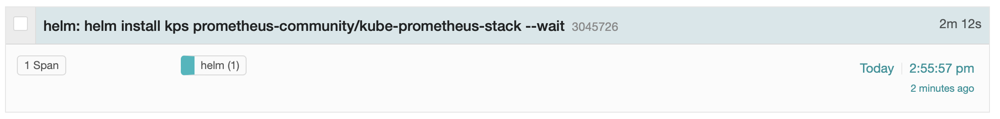

# Helm Plugin to Generate OpenTelemetry Traces

[](https://artifacthub.io/packages/search?repo=helm-trace)

Helm Plugin to generate OpenTelemetry traces for helm commands.

```
helm trace <Your Standard helm Command>
```



### YouTube: Helm Trace Code Walkthrough

[Watch on YouTube](https://youtu.be/Zjq3NTEydkI?t=478)

[](https://www.youtube.com/watch?v=Zjq3NTEydkI&t=478)

## Prerequisites
- Currently only supports Linux and MacOS
- You must have [a standalone binary of tracepusher in your path](https://github.com/agardnerIT/tracepusher/releases/latest) (ie. you are able to run `tracepusher` from the command line and see output)
- You must have an OpenTelemetry collector somewhere so the spans can be sent there

## Install Plugin

```
helm plugin install https://github.com/agardnerit/helm-trace
```

## Use the Plugin

1. Ensure you have an OpenTelemetry Collector available
2. Add the word `trace` after `helm` in your standard command. For example `helm version` becomes `helm trace version`

## Defaults and Configuration

The plugin assumes the following:

- The OTEL collector URL defaults to `http://localhost:4318`
- The span service name defaults to `helm`

Use environment variable: `HT_OTELCOL_ENDPOINT` to specify your collector endpoint

Use environment variable: `HT_SERVICE_NAME` to specify a different service name

```
export HT_OTEL_ENDPOINT=http://otelcol.somewhere.com:4318
export HT_OTEL_ENDPOINT=helm-dev
helm trace install ...
```

## Remove Plugin

```
helm plugin remove trace
```
